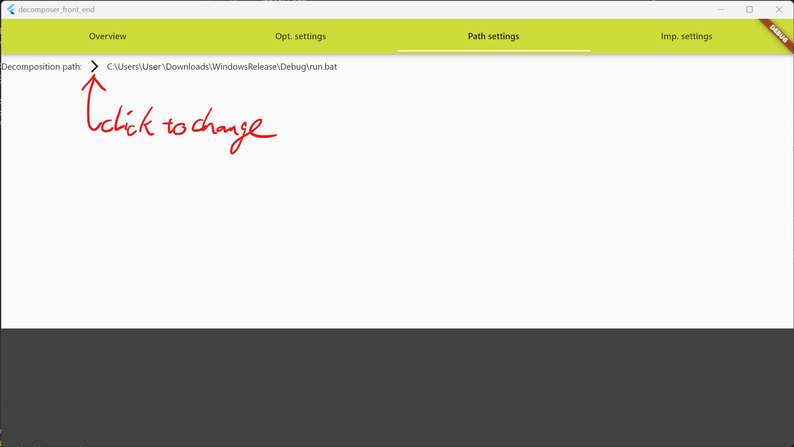
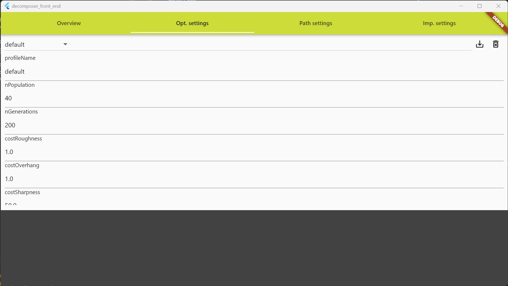
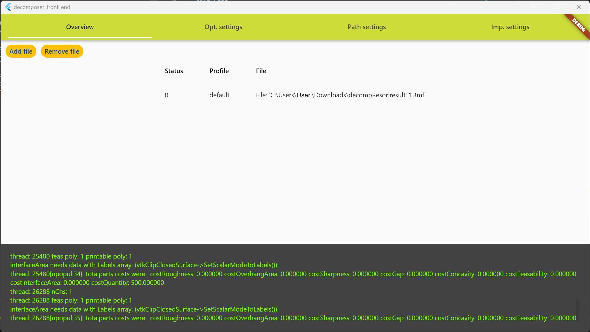

# decomposer_front_end

A Flutter app to make the usage of [Part decomposition for additive manufacturing](https://github.com/hi2010/Part-decomposition-for-additive-manufacturing) more convenient

## Getting Started

Download the decomposition app for your os.
Then open this app and got to the settings page.
Set the decomposer path by clicking on the arrow in the gui.
From the filepicker choose the starting script of the decomposer application.
Afterwards you may go on profile settings page and create a profile.
To start a decomposition go on the overview page and create a job by clicking add.
The file needs to be of 3mf format to work.
For 3mf creation (from obj) [obj23mf](https://github.com/hi2010/obj23mf) is recommended.
To know where the results of the decomposition get stored look at the console on the lower part of the gui application, ..., but it should be in the same folder as the original 3mf file.

## Before use setup in imgs:

Set decomposition executable path

Adjust decomposition settings

Create a decomposition job (valid 3mf file !)

## Build info:
This app uses [sqfliteffi](https://pub.dev/packages/sqflite_common_ffi).
Because of this the sqlite3.dll needs to be in the same folder as the exe for the database part to work.
